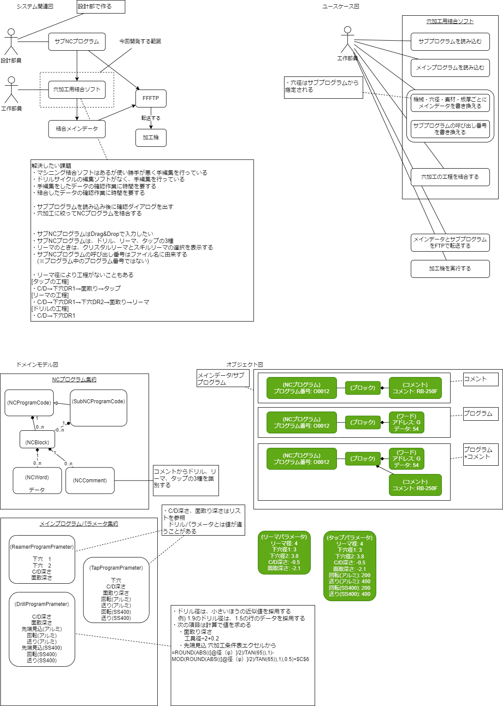

# 穴加工用マシニングソフト

NCProgramConcatenationForHoleDrilling

## 使用方法

1. アプリケーションを起動する。

2. サブプログラムをドラッグ＆ドロップする。
3. 注記内容確認画面が開く。 

4. サブプログラムの内容を確認し、「OK」ボタンをクリックする。
5. 注記内容確認画面が閉じ、元の画面に戻る。
6. 加工機を選択し、どの加工機用のプログラムにするか指示する。
7. 材質を選択する。
8. リーマの種類を選択する。(※ サブプログラムの作業指示がリーマの場合)
9. 板厚を入力する。
10. 「進む」ボタンをクリックする。
11. オープンレビュー画面が開く。 

12. 結合内容を確認し、「保存」ボタンをクリックする。
13. 名前を付けて保存画面が開く。 

14. ファイル名を指定して、「保存」ボタンをクリックする。

## 事前準備

定期的に齟齬がないか、メインプログラムとリストの見直しをする必要がある。
また、一部の工程の結合をする場合でも、全てのファイルが揃っている必要がある。

### メインプログラム

メインプログラムは、機種ごと・作業工程ごと、それぞれ保存しておく必要がある。ファイル名は、命名規則に沿う必要があり、機種名と工程をアンダーバーで区切った構成とする。
工程は、下の5工程を指す。

* センタードリル → CD.txt
* 下穴 → CR.txt
* 面取り → MENTORI.txt
* リーマ → REAMER.txt
* タップ → TAP.txt

### リスト

リストには、工程ごとの加工設定値がまとめられている。これも定期的に齟齬がないか確認する必要がある。
ファイル名は、ここにある通りで、変更はできない。

## 技術情報

