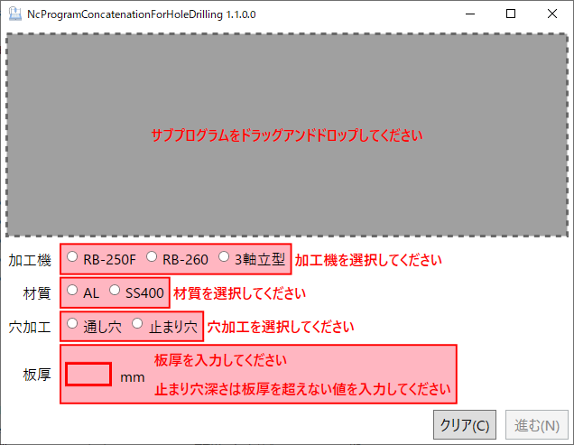

# 穴加工用マシニングソフト

NcProgramConcatenationForHoleDrilling

- [1. 使用方法](#1-使用方法)
- [2. 事前準備](#2-事前準備)
  - [2.1. メインプログラム](#21-メインプログラム)
  - [2.2. リスト](#22-リスト)
- [3. 技術情報](#3-技術情報)

## 1. 使用方法

1. アプリケーションを起動します。

    

2. サブプログラムをドラッグ＆ドロップします。
3. 注記内容確認画面が開きます。

    

4. サブプログラムの内容を確認し、「OK」ボタンをクリックします。
5. 注記内容確認画面が閉じ、元の画面に戻ります。
6. 加工情報を入力します

   1. 加工機を選択し、どの加工機用のプログラムにするか指示します。
   2. 材質を選択します。
   3. 穴加工を選択します。

        止まり穴を選択した場合は、下穴深さと止まり穴深さを入力します。

        

        ※ サブプログラムがドリルの場合は、止まり穴深さのみ入力します。

   4. リーマの種類を選択します。

        ※ サブプログラムの作業指示がリーマの場合に表示されます。

   5. 板厚を入力します。

7. 「進む」ボタンをクリックします。

    ※ 全てを入力するまで、ボタンは有効になりません。

8. オープンレビュー画面が開きます。

    

9. 結合内容を確認し、「保存」ボタンをクリックします。
10. 名前を付けて保存画面が開きます。

    

11. ファイル名を指定して、「保存」ボタンをクリックします。

## 2. 事前準備

定期的に齟齬がないか、メインプログラムとリストの見直しをする必要があります。
また、一部の工程の結合をする場合でも、全てのファイルが揃っている必要があります。

### 2.1. メインプログラム

メインプログラムは、機種ごと・作業工程ごと、それぞれ保存しておく必要があります。ファイル名は、命名規則に沿う必要があり、機種名と工程をアンダーバーで区切った構成とします。
工程は、下の5工程を指す。

- センタードリル → CD.txt
- 下穴 → CR.txt
- 面取り → MENTORI.txt
- リーマ → REAMER.txt
- タップ → TAP.txt

### 2.2. リスト

リストには、工程ごとの加工設定値がまとめられている。これも定期的に齟齬がないか確認する必要があります。
ファイル名は、ここにある通りで、変更はできません。

## 3. 技術情報

